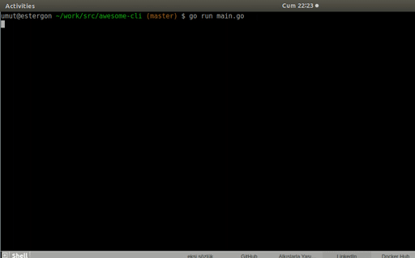

# awesome-cli

Awesome CLI is a simple and immature command line tool to give you a fancy command line interface to dive into [Awesome](https://github.com/sindresorhus/awesome) lists.

 [](https://app.wospm.info/project/A42eGNpyGO)

---
<!-- START doctoc generated TOC please keep comment here to allow auto update -->
<!-- DON'T EDIT THIS SECTION, INSTEAD RE-RUN doctoc TO UPDATE -->


- [Introduction](#introduction)
- [How To Install And Use](#how-to-install-and-use)
  - [Basic](#basic)
  - [Build as binary](#build-as-binary)
  - [Sample Execution](#sample-execution)
- [How To Contribute](#how-to-contribute)

<!-- END doctoc generated TOC please keep comment here to allow auto update -->
---

## Introduction

The CLI starts with the root repository [sindresorhus/awesome](https://github.com/sindresorhus/awesome) and guides to to the final repo according to your choices. It fetches Readme files of the repositories and parses them to create the select lists. So, the CLI needs a working network :). It also uses file caches to cache the Readme file contents. You can find the cache folder with name ".awsomecache" under your home folder.



## How To Install And Use

### Basic

Follow the steps;

```bash
git clone git@github.com:umutphp/awesome-cli.git
cd awesome-cli
go run main.go
```

### Build as binary

Follow the steps;

```bash
git clone git@github.com:umutphp/awesome-cli.git
cd awesome-cli
sudo go build -o /usr/local/bin/awesome-cli .
awesome-cli
```

### Sample Execution

```bash
> $ go run main.go
aweome-cli Version 0.0.1
✔ Back-End Development
You choose "Back-End Development"
✔ Pyramid
You choose "Pyramid Python framework."
✔ Async
You choose "Async"
✔ aiopyramid
You choose "aiopyramid"
```

## How To Contribute
Please follow the instructions in [CONTRIBUTING](CONTRIBUTING.md) file and beware of [CODE_OF_CONDUCT](CODE_OF_CONDUCT).
